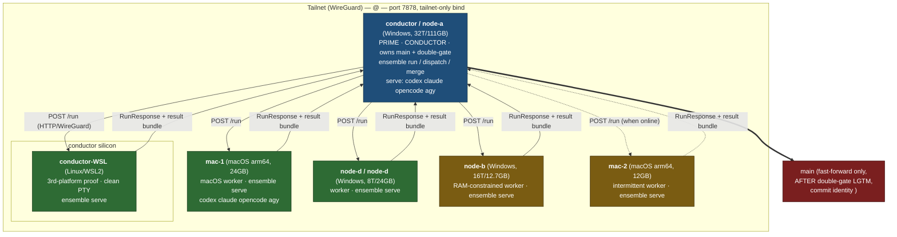

# Stage 2 — Full-Fleet Federation + OSS Re-install ("開源重裝")

> **Status:** PLAN (2026-06-21). Planning-only deliverable — no code, git, installer, or
> cross-machine action is taken by this document. Every command below is meant to be run by
> the operator, in order, with a stated success check.
>
> **Two goals, one playbook:**
> 1. **Stage 2 federation** — bring the full fleet (5 physical machines + conductor's WSL-Linux
>    node) online and prove they run ensemble *jointly* as one federated crew across **three
>    platforms** (Windows, macOS, WSL/Linux) over Tailscale, landing real cross-vendor work
>    through the **double-gate**.
> 2. **開源重裝** — an open-source release of ensemble and a clean reinstall/upgrade of the
>    single binary + the four AI CLIs across every node.
>
> **Grounding:** this plan is written against the actual code — `src/serve.rs`
> (`resolve_bind`, `/health`+`/run`), `src/discovery.rs` (`discover_mesh`,
> `discover_agent_hosts`, `self_tailscale_ips`, bounded `tailscale status`, parallel
> `/health` with an 800 ms connect cap), `src/repo_sync.rs` (bundle→materialize→commit→
> bundle-back→ff-merge, conflict-never-auto-resolved), `src/remote_adapter.rs` (HTTP-over-
> tailnet RPC, branch-injection guard), `src/conductor.rs` (round loop → test gate →
> reviewers → `gate::decide` → land/escalate), `src/crew.rs` (`min_approvals`, `node=`
> per-agent), `src/doctor.rs` (`run_checks`/`present_clis`), `src/mcp_install.rs`
> (`render_merged` per client), and `src/main.rs` (every subcommand + flag). The port is
> **7878** everywhere (hardcoded in `serve_cmd`/`discover_mesh`/`resolve_one`).

---

## 0. The moat, in one line (keep the scope honest)

ensemble's moat is **cross-vendor _governed_ landing** — ≥2 distinct-vendor AIs must both end
`VERDICT: LGTM` before a fast-forward merge to `main`. Stage 2 proves that governance holds
*across machines and across OSes*. 開源重裝 cuts **accidental friction** (one-click MCP install,
prebuilt binaries, a clean reinstall path) — it does **not** widen the niche. Anything that is
not "make the governed cross-vendor flow easy to install and run" is out of scope here.

---

## 1. Topology + roles

### 1.1 Role/concurrency table (derived from measured cores/RAM)

Concurrency budget = how many isolated git worktrees / agent turns a node carries at once.
`run_many`/`dispatch` spawn one OS thread per task (`conductor.rs::run_many`), and each
governed task may fan turns out to several CLIs, so the budget is bounded by the *smaller* of
(cores, RAM ÷ ~2 GB per concurrent CLI). Verify the live numbers at run time (next sub-section)
— do **not** trust the pasted values; they drift.

| Node | Tailscale name | OS / platform | Cores | RAM | Role | Local CLIs hosted (`serve`) | Concurrency budget |
|---|---|---|---|---|---|---|---|
| **conductor** | `node-a` | Windows 11 | 16C/32T | 111.6 GB | **PRIME / conductor** — runs `ensemble run`, owns `main`, runs the double-gate, heavy parallelism | codex, claude, opencode, agy | **6–8** worktrees |
| **conductor-WSL** | (shares conductor's tailnet IP, or its own if `tailscale up` inside WSL) | WSL2 Linux | shares conductor | shares conductor | **3rd-platform portability proof** — a Linux `serve` node; clean Unix PTY for agy | codex, claude, opencode, agy (whichever are installed in WSL) | **2–3** (shares conductor silicon) |
| **mac-1** | `node-c` | macOS arm64 | ~10–14 (confirm) | 24 GB | **macOS worker** — primary Mac agent host; clean Unix PTY | codex, claude, opencode, agy | **3–4** |
| **node-d** | `node-d` | Windows | 4C/8T | 23.8 GB | Windows worker | codex, claude (whichever installed) | **2** |
| **node-b** | `node-b` | Windows | 8C/16T | 12.7 GB | **RAM-constrained** Windows worker — fewer worktrees | codex, claude (1 heavy CLI at a time) | **1–2** |
| **mac-2** | `node-e` | macOS arm64 | 8 (4P+4E) | 12 GB | **RAM-constrained + intermittent** — may be offline; portable | codex, claude | **1** |

Notes:
- **Conductor = conductor only.** Workers run `ensemble serve` and host CLIs; only the conductor
  runs `ensemble run`/`dispatch` and lands to `main`. The double-gate lives on the conductor.
- **conductor-WSL is the third-platform proof.** It need not host *new* capability — its job is to
  show a Linux node `serve`s, runs an agent turn, and returns edits via `repo_sync` exactly
  like a Windows/macOS node. See §7 open question on whether the WSL node and conductor-Windows node
  coexist on one tailnet IP or the WSL node runs its own `tailscale up`.
- **RAM-constrained nodes** (node-b 12.7 GB, mac-2 12 GB) host at most one heavy CLI run at a
  time. Do **not** point a fan-out task's whole quorum at them.
- **mac-2 is intermittent.** The plan must degrade cleanly when it is offline — and it does:
  `discover_mesh` only probes `online` peers, and `probe_agents` caps each connect at 800 ms
  (`discovery.rs`), so an absent mac-2 never stalls discovery.

### 1.2 Verify the live numbers (don't hardcode)

Run on each node before assigning its budget:

```powershell
# Windows (PowerShell) — conductor / node-d / node-b
(Get-CimInstance Win32_ComputerSystem).NumberOfLogicalProcessors
[math]::Round((Get-CimInstance Win32_ComputerSystem).TotalPhysicalMemory/1GB,1)
```
```bash
# macOS (zsh) — mac-1 / mac-2
sysctl -n hw.logicalcpu ; echo "$(($(sysctl -n hw.memsize)/1073741824)) GB"
```
```bash
# WSL (bash) — conductor-WSL
nproc ; free -g | awk '/Mem:/{print $2" GB"}'
```

### 1.3 Tailnet topology diagram



---

## 2. Bring-up flow

The federated run is identical in mechanism to a local run — a `RemoteAdapter` is
indistinguishable from a local adapter to the conductor (`remote_adapter.rs` doc comment). The
only new things at bring-up are: turn off your VPN, `tailscale up`, start `serve` on each
worker, and point the conductor's crew at the discovered hosts.

```mermaid
flowchart TD
    A["Cold machines"] --> B{"your VPN<br/>(WireGuard) running?"}
    B -- yes --> B1["Turn OFF your VPN<br/>(WireGuard ↔ Tailscale collision —<br/>the #1 bring-up gotcha)"]
    B -- no --> C
    B1 --> C["tailscale up — on EVERY node"]
    C --> D["ensemble doctor — per node<br/>(verify CLIs + tailscale + git-repo;<br/>exit 0 = ready)"]
    D -- "not ready" --> D1["install/login the missing CLI(s)<br/>(§5 reinstall) → re-doctor"]
    D -- ready --> E["ensemble serve — on every WORKER<br/>(binds tailnet IPv4:7878, never 0.0.0.0)"]
    E --> F["conductor: ensemble mesh / nodes<br/>(discover_mesh probes online peers'<br/>/health in parallel, 800ms connect cap)"]
    F -- "hosts missing" --> F1["fix serve/tailscale on the absent node<br/>(check your VPN, tailscale status)"]
    F -- "mesh looks right" --> G["SMALLEST PROOF first:<br/>2 machines, 2 vendors (§3.4)"]
    G -- "fails" --> G1["diagnose (curl /health, --node explicit)<br/>before scaling up"]
    G -- "passes" --> H["FULL federated run from conductor:<br/>ensemble run \"&lt;task&gt;\" --crew fleet-crew.toml"]

    H --> I["conductor fans turns across vendors+machines<br/>(adapters_for resolves agent→node:<br/>explicit node= &gt; discovered &gt; local)"]
    I --> J["each node: materialize base bundle →<br/>agent edits → commit on dispatch/&lt;job&gt; →<br/>bundle back (repo_sync)"]
    J --> K["conductor ff-applies each result into<br/>the run's worktree (apply_result,<br/>branch-injection guarded)"]
    K --> L["TEST GATE (firewall A):<br/>cargo test must be GREEN"]
    L -- "RED" --> I
    L -- "GREEN" --> M{{"DOUBLE-GATE (hard barrier):<br/>≥2 DISTINCT-VENDOR reviewers<br/>both VERDICT: LGTM?<br/>(min_approvals=2)"}}
    M -- "no / flaked" --> mac-2["Iterate (feedback → implementer)<br/>or Escalate — NEVER land"]
    M -- "yes (codex + claude LGTM)" --> N["LAND: fast-forward merge to main<br/>commit as <you> &lt;you@example.com&gt;"]

    style M fill:#7a1f1f,color:#fff
    style N fill:#1f4e79,color:#fff
    style B1 fill:#7a5c12,color:#fff
```

### Why the gate is a real barrier (in code)

- `conductor.rs::run` runs reviewers, collects `RoleVerdict`s, calls `gate::decide`.
- `gate::decide` returns `Land` **only** when `approvals >= policy.min_approvals`. A flaked
  reviewer is *excluded* (never counted as approval); an all-flaked round has zero verdicts and
  **Escalates** — quorum is never faked from absent reviewers.
- A remote node's edits arrive via `repo_sync::apply_result` as a **fast-forward only** merge
  into the run's worktree; a conflict is never auto-resolved (`merge_branch` aborts and
  restores). So a federated edit still passes through the same governance as a local one.
- Set `min_approvals = 2` with two **distinct-vendor** reviewer roles (codex + claude) so "≥2
  distinct vendors" is structurally enforced by the crew config (§3.2).

---

## 3. Execution playbook

> Conventions: **[conductor]** = run on the conductor; **[worker]** = run on every worker node;
> **[node]** = run on the node named. Each block states its success check. Replace
> `<tailnet-ipv4>`/`<host>` with values you **read at run time** — never paste an IP from this
> doc into a command without confirming it with `tailscale ip -4` / `tailscale status`.

### 3.0 Pre-flight: kill the #1 gotcha (every node)

your VPN (WireGuard) collides with Tailscale (also WireGuard). Turn your VPN **off first**.

```powershell
# [Windows node] — confirm your VPN/WireGuard is not holding the tunnel, then bring tailscale up
Get-Service -Name "*your-vpn*","*WireGuard*" -ErrorAction SilentlyContinue | Select Name,Status
# Quit your VPN from its tray app / disconnect, THEN:
tailscale up
tailscale status        # success: peers listed, Self has a 100.x IP
tailscale ip -4         # success: prints this node's 100.x address
```
```bash
# [macOS / WSL node]
pgrep -fl -i your-vpn || echo "no your-vpn process"   # quit the app if present
tailscale up
tailscale status && tailscale ip -4   # success: peers + this node's 100.x
```
**Success check (all):** `tailscale status` lists the other fleet nodes; `tailscale ip -4`
prints a `100.x` address. If cross-machine is still blocked, re-confirm your VPN is fully off
(see memory: your-vpn-tailscale-wireguard-conflict).

### 3.1 Readiness: `ensemble doctor` (every node)

```powershell
# [any node] — from inside the ensemble repo checkout (git-repo check needs it)
ensemble doctor
```
`doctor` prints each of codex / claude / opencode / agy / tailscale / git-repo with `ok` or
`MISSING`. **Success check:** exit code 0 ("ready: a crew can run here"), which requires a git
repo in cwd **and** at least one AI CLI on PATH (`doctor::is_ready`). A `MISSING` CLI is a
warning unless it's the only one — fix it via §5 and re-run. **Re-verify actual versions here**
rather than trusting any pasted numbers:

```powershell
# [any node] — print real versions (the gate uses codex daily even though its node.json says working:false)
codex --version ; claude --version ; opencode --version ; agy --version
```

### 3.2 The federated crew config (`fleet-crew.toml`, lives on conductor)

Pin reviewers to distinct vendors so the double-gate = two vendors structurally. Pin remote
agents with explicit `node=` for a *deterministic* proof (auto-discovery also works — §3.3 —
but explicit is reproducible). Use the **bare host → `http://<host>:7878`** form the code
accepts, or a full URL.

```toml
# fleet-crew.toml  (on conductor)  — codex implements, claude + (agy|opencode) review = ≥2 vendors
pipeline = ["implement", "review", "debug"]

[gate]
min_approvals = 2            # the DOUBLE-GATE: two distinct-vendor reviewers must both LGTM
max_rounds    = 3
on_flake      = "exclude"    # a flaked reviewer is dropped, never faked into a pass
stall_limit   = 3            # circuit-breaker: bail after 3 no-progress rounds
max_task_secs = 1800         # wall-clock budget per task

[test]
command = "cargo test --quiet"   # firewall A: GREEN before reviewers run

[roles.implement]
agent = "codex"

[roles.review]
agent = "claude"
blind = true                # anti-anchoring: don't show claude the other verdict

[roles.debug]
agent = "opencode"          # a 3rd distinct vendor as the second reviewer

# Drive specific agents on specific machines (explicit > discovered > local).
# Read each host's real tailnet name with `tailscale status`; bare host → http://<host>:7878.
[agents.claude]
node = "node-c"   # claude review runs on the mac-1 (macOS) — cross-platform proof

[agents.opencode]
node = "node-b"             # opencode debug runs on node-b (Windows) — RAM-constrained: 1 at a time
```

> The conductor resolves each role's agent in `main.rs::adapters_for`: an explicit
> `[agents.<n>] node=` always wins, else (discovery on) a tailnet peer hosting that agent, else
> the local CLI. So `codex` (no `node=`) runs **locally on conductor**, `claude` on the mac-1, `opencode`
> on node-b — a single task fanned across **3 machines + 2 OSes + 3 vendors**.

### 3.3 Start serving (every worker)

```powershell
# [worker: node-d / node-b / conductor-as-host-too] — Windows
cd <path-to-ensemble-repo>
ensemble up            # prints the mesh, then serves on the tailnet IP:7878 (Ctrl-C to stop)
# or, headless/background-friendly:  ensemble serve
```
```bash
# [worker: mac-1 / mac-2] — macOS
cd <path-to-ensemble-repo> && ensemble up
```
```bash
# [worker: conductor-WSL] — Linux. Inside WSL, confirm tailscale is up in THIS namespace first.
cd /mnt/d/Projects/ensemble    # or a native clone; see §7 on shared-vs-own tailnet IP
ensemble up
```
**Success check (worker):** the banner shows `serving on <100.x>:7878` and `local CLIs : …`.
From any other node: `curl http://<that-100.x>:7878/health` returns `{"ok":true,"agents":[…]}`.
If it binds **loopback** instead (warning printed), tailscale has no IP on that node — fix §3.0.

### 3.4 Smallest federated proof FIRST (2 machines, 2 vendors)

Before the 5-machine run, prove the wire end-to-end with the least moving parts: conductor (conductor
+ local codex) drives **one** remote vendor on **one** other machine. The `agent` verb does a
real git-sync round-trip (base bundle → remote edit → ff back into `--repo`).

```powershell
# [conductor] — pick a node that is serving claude (e.g. the mac-1). Read its name from `tailscale status`.
ensemble agent claude "Append a line 'federation smoke OK' to FEDERATION_SMOKE.md" --node node-c --repo . --json
```
**Success check:** JSON `{"agent":"claude","node":"http://node-c:7878","ok":true,…}`
**and** `git status` on conductor shows `FEDERATION_SMOKE.md` changed (the remote edit fast-forwarded
back via `repo_sync::apply_result`). If `ok:false`, diagnose with `curl …/health` and an
explicit `--node` before scaling up. (Discard the smoke file afterward — do not commit it.)

> Why `agent` first: it exercises the exact transport (`/run` + `RepoCtx` bundle + branch-
> injection guard + ff-apply) that the full `run` uses, but with one vendor and no gate, so a
> failure is unambiguous.

### 3.5 The full federated governed run (5 machines, 3 OSes, double-gate → main)

```powershell
# [conductor] — ensure main is clean (worktree merge needs a clean tree) and you're on main
git -C <repo> switch main ; git -C <repo> status --porcelain   # success: empty output

# Drive the governed crew. codex (conductor) implements; claude (mac-1/macOS) + opencode (node-b/Win) review.
# Edits from remote nodes return via repo_sync; the test gate must be GREEN; then the DOUBLE-GATE.
ensemble run "<a real, scoped task on this repo>" --crew fleet-crew.toml --repo .
```
**What you should see (and the success check):**
- `─── transcript ───` showing codex's result, the test result, and **two** reviewer verdicts
  from **distinct vendors** ending `VERDICT: LGTM`.
- `LANDED after N round(s) → work kept on branch \`ensemble/<slug>\``.
- The work is on a kept branch (not yet on `main`) — `run` lands the *crew decision*, then you
  land the branch to `main` under the right identity:

```powershell
# [conductor] — set the repo-local identity FIRST (never the global Clewtex identity)
git -C <repo> config user.name  "<you>"
git -C <repo> config user.email "you@example.com"

# Land the gated branch to main (fast-forward / true-merge; conflict → escalates, never auto-resolves)
ensemble merge ensemble/<slug> --into main --repo .
```
Or do it in one shot with `ensemble run "…" --crew fleet-crew.toml --merge --into main` (auto-
lands the kept branch after a LANDED run; an auto-merge conflict is a soft failure that leaves
the work safe on the branch).

**Federation success criteria (all must hold):**
1. The transcript shows turns that ran on **≥2 other machines** and **≥2 other OSes** (codex
   local on conductor-Windows + claude on macOS + opencode on a second Windows box; swap one reviewer
   to the **conductor-WSL** node to tick the Linux box — see §3.6).
2. **Two distinct-vendor** `VERDICT: LGTM` lines gated the land (`min_approvals=2`).
3. The merge to `main` is a **fast-forward**, authored `<you> <you@example.com>`.

### 3.6 Tick the third platform (WSL/Linux) explicitly

To make the Linux node load-bearing in the proof, point one reviewer at it for a run:

```powershell
# [conductor] one-off: drive claude review on the WSL node instead of the mac-1
ensemble agent claude "Review: does <file> satisfy <task>? End with VERDICT: LGTM or CHANGES." --node <wsl-host-or-100.x> --repo .
```
Or temporarily set `[agents.claude] node = "<wsl-host>"` in a copy of `fleet-crew.toml` and run
§3.5. **Success check:** the transcript's claude turn shows it executed on the Linux node, and
the edit/verdict returned over `repo_sync`/HTTP. Linux agy uses a normal PTY (no ConPTY), so
agy-on-WSL is the clean-PTY datapoint.

### 3.7 Durable variant (optional, for a batch)

For a resumable multi-task batch across the fleet, use the ledger so a dropped node (mac-2 going
offline) doesn't lose work:

```powershell
# [conductor]
ensemble dispatch "task A" "task B" "task C" --ledger fleet.db --crew fleet-crew.toml --repo .
ensemble ledger status --ledger fleet.db        # success: done/failed/queued/claimed counts
```

---

## 4. Open-source release ("開源重裝") checklist

### 4.1 Already in place (verified in-repo)

- **License: Apache-2.0** — `LICENSE` exists; `Cargo.toml` declares `license = "Apache-2.0"`.
  ✅ No license decision needed (but confirm a NOTICE file isn't required for your deps).
- **`.gitignore`** already excludes `/target`, `/target-*` (stray gate/review build dirs),
  `Cargo.lock`, `/.ensemble/`, `*.blackboard.jsonl`. ✅ Matches the "scrub" needs below.
- **README.md** exists with the crew model + roadmap. ⚠️ Says *"Status: early… Not yet usable"*
  and "Phase 0 in progress" — **stale**; update to the real state (MCP API code-complete,
  federation working) before publishing.
- **One-click MCP install** is built (`src/mcp_install.rs` + `ensemble mcp install`). ✅

### 4.2 Release blockers (must do before publishing)

| # | Blocker | Action | Success check |
|---|---|---|---|
| B1 | **Version is `0.0.0`** | Bump `Cargo.toml` `version` to a real release (e.g. `0.1.0`); tag `v0.1.0` | `cargo pkgid` shows the version; `git tag` lists it |
| B2 | **README is stale** | Rewrite "Status/Roadmap" to reflect: governed double-gate, cross-machine over Tailscale, MCP crew API, `ensemble up`/`doctor`/`mcp install` quickstart | README quickstart commands all run |
| B3 | **No quickstart that matches the binary** | Add an "Install → up → run" section grounded in real commands (`cargo install ensemble` / release binary → `ensemble doctor` → `ensemble up` → `ensemble mcp install --client …`) | A fresh user can follow it without reading source |
| B4 | **Scrub before public push** | See §4.4 | `git grep` finds no tailnet IPs / machine names / secrets in tracked files |
| B5 | **No prebuilt binaries / CI** | Add GitHub Actions release workflow (§4.3) | A tagged dry-run produces all 4 artifacts |
| B6 | **Public repo name + visibility** | Operator decision (§7) | repo created, `main` pushed |

### 4.3 Per-platform packaging (single binary)

Build a release binary per target; name to the `cargo-binstall` convention so `cargo binstall
ensemble` works for free (matches the OSS-onboarding spec, component A).

```powershell
# [conductor] Windows x86_64
cargo build --release --target x86_64-pc-windows-msvc
#   artifact: target\x86_64-pc-windows-msvc\release\ensemble.exe
```
```bash
# [mac-1 / mac-2] macOS arm64 (native build on a Mac — cross from Windows is impractical)
cargo build --release --target aarch64-apple-darwin
#   artifact: target/aarch64-apple-darwin/release/ensemble
# (also x86_64-apple-darwin if you want Intel-Mac coverage)
```
```bash
# [conductor-WSL] Linux x86_64  — use the alternate target dir to dodge Defender LNK1104 on /mnt
cd /mnt/d/Projects/ensemble && CARGO_TARGET_DIR=$HOME/ensemble-target cargo build --release --target x86_64-unknown-linux-gnu
#   artifact: $HOME/ensemble-target/x86_64-unknown-linux-gnu/release/ensemble
```
Targets to ship (per the spec): `x86_64-pc-windows-msvc`, `aarch64-apple-darwin`,
`x86_64-apple-darwin`, `x86_64-unknown-linux-gnu`. **Version stamping:** the release version
comes from `Cargo.toml`; surface it (a future `ensemble --version` is worth adding, but is not a
release blocker — `cargo pkgid` is the source of truth meanwhile).

### 4.4 Scrub list (what must NOT be published)

Run before any public push; **success = each command finds nothing** in tracked files:

```bash
# tailnet IPs (100.x), machine names, the operator's email, any token-ish strings
git grep -nE '100\.(8[0-9]|10[0-9]|11[0-9])\.[0-9]+\.[0-9]+'      # tailnet IPv4s
git grep -niE 'node-a|node-b|node-d|markmacbook|node-c|extra-host'  # host names
git grep -niE '<user>@gmail\.com|your-vpn|'   # email / VPN / ACL leakage
# confirm runtime scratch + build dirs are untracked
git status --porcelain --ignored | Select-String '\.ensemble|target-'
```
Also confirm by inspection: no `.ensemble/` artifacts (board.jsonl, ledger.db, runs/, stream/,
control/) are tracked; no `Cargo.lock` is tracked (it's gitignored by design); no stray
`target-*/` review dirs (the `git add -A` lesson). The `docs/` design notes reference machine
names/IPs — decide (§7) whether to scrub `docs/` or keep design history private and publish a
clean subset.

### 4.5 Positioning the release (one paragraph in the README)

Lead with the moat: *"the only orchestrator that makes ≥2 **different-vendor** AI coding CLIs
both sign off before code lands — across your machines, over Tailscale."* Then the one-click on-
ramp (`cargo install` → `ensemble up` → `ensemble mcp install`). Do **not** advertise breadth
(every CLI, every transport) — the niche is the point.

---

## 5. Reinstall / upgrade procedure (per node)

Goal: every node ends on the same fresh ensemble binary + the four CLIs, re-doctored, re-joined.
Order per node: **(a) refresh binary → (b) install/upgrade the 4 CLIs → (c) `ensemble doctor` →
(d) re-`serve`/re-mesh.**

### 5.1 conductor (PRIME, Windows) — rebuild from source

```powershell
# [conductor] pull, build release, verify
cd <repo> && git pull
cargo build --release            # if native build hits Defender LNK1104, build via WSL (§5.5) and copy out
.\target\release\ensemble.exe doctor    # (d) success: "ready"
```

### 5.2 Windows workers (node-d, node-b) — fetch binary, no toolchain needed

No SSH automation (the `~/.ssh/config` `` ACL breaks `tailscale ssh`; see
memory). Use **Taildrop**:

```powershell
# [conductor] push the fresh exe to each worker
tailscale file cp .\target\release\ensemble.exe node-b:
tailscale file cp .\target\release\ensemble.exe node-d:
```
```powershell
# [node-d / node-b] receive + verify  (node-b is RAM-constrained: one heavy CLI at a time)
tailscale file get .
.\ensemble.exe doctor
```

### 5.3 macOS workers (mac-1, mac-2) — native arm64 build

Windows-cross to macOS is impractical; build on a Mac (one arm64 build serves both Macs, but
each must have the binary on its PATH):

```bash
# [mac-1] build once
cd <repo> && git pull && cargo build --release --target aarch64-apple-darwin
# copy to mac-2 via Taildrop (mac-2 is intermittent — do it while it's online)
tailscale file cp target/aarch64-apple-darwin/release/ensemble node-e:
```
```bash
# [mac-2] receive + verify  (RAM-constrained + intermittent → budget 1)
tailscale file get . && ./ensemble doctor
```

### 5.4 The four AI CLIs (every node)

`ensemble doctor` tells you which are missing; install/upgrade them with the vendors' own
installers, then **log in** (doctor checks PATH presence, not login — an un-logged-in CLI still
shows `ok`). Re-verify versions (§3.1) — do not trust pasted numbers. Per-platform notes:
- **agy on Windows** needs ConPTY wrapping (documented cloned-reader EOF limit in
  `agy_adapter.rs`); `--print-timeout` is already handled by the adapter. On **macOS/WSL** agy
  uses a normal PTY (clean).
- **codex** may self-report `working:false` in its node.json — **ignore it**; the double-gate
  uses codex daily. Trust `codex --version` + a live `ensemble agent codex "PONG"` instead.

### 5.5 WSL/Linux node — build in WSL, run in WSL

```bash
# [conductor-WSL] use the alternate target dir (native /mnt build can hit Defender LNK1104)
cd /mnt/d/Projects/ensemble && CARGO_TARGET_DIR=$HOME/ensemble-target cargo build --release
$HOME/ensemble-target/release/ensemble doctor   # success: "ready"
```

### 5.6 Re-join the mesh (every node, after doctor passes)

```powershell
# [worker] re-serve
ensemble serve            # or `ensemble up`
```
```powershell
# [conductor] confirm the whole fleet is visible again
ensemble mesh             # success: each online worker → the agents it hosts
ensemble nodes            # success: agent → host URL map
```
RAM-constrained (node-b, mac-2) and intermittent (mac-2) nodes need no special re-join — discovery
probes only `online` peers and caps each connect at 800 ms, so an offline mac-2 is simply absent
from `mesh` and rejoins automatically when it comes back online and `serve`s.

---

## 6. Risk register

| Risk | Trigger | Mitigation | Owner step |
|---|---|---|---|
| **your VPN ↔ Tailscale WireGuard collision** (#1 gotcha) | your VPN running when you `tailscale up` → cross-machine blocked | Quit your VPN **first**, then `tailscale up`; verify `tailscale status` lists peers | §3.0 |
| **agy ConPTY on Windows** | agy run on conductor/node-d/node-b | Known cloned-reader EOF limit (`agy_adapter.rs`); `--print-timeout` handled. Prefer agy on macOS/WSL (normal PTY); on Windows treat agy as best-effort, keep the gate on codex+claude | §3.2 (don't put agy in the 2-vendor quorum on Windows), §5.4 |
| **RAM-constrained node thrash** (node-b 12.7 GB, mac-2 12 GB) | Multiple heavy CLI turns concurrently | Budget 1–2; never point a fan-out quorum at them; pin only one light reviewer role | §1.1, §3.2 |
| **mac-2 offline mid-run** | Intermittent/portable node drops | Discovery probes only `online` peers (800 ms connect cap) → absent mac-2 never stalls; use `dispatch --ledger` so its claimed tasks recover (orphan recovery after 5 min) | §3.7, §5.6 |
| **Discovery slow on a multi-device tailnet** | Idle iOS/Android peers drop :7878 | Already fixed (`probe_agents` `timeout_connect(800ms)`, parallel `probe_all`); if still slow, use explicit `--node <host>` to skip discovery | §3.4 (explicit node), `discovery.rs` |
| **serve binds loopback (local-only) by mistake** | Node has no tailnet IP (tailscale logged out) | `resolve_bind` warns + binds 127.0.0.1, never 0.0.0.0; fix tailscale and re-serve | §3.0, §3.3 |
| **Wrong commit identity on landed work** | Global `Clewtex` identity leaks into ensemble commits | Set repo-local `<you> <you@example.com>` before `merge`; verify `git log -1 --format='%an <%ae>'` | §3.5 (memory: git-identity-<you>) |
| **`git add -A` sweeps stray build dirs** | Committing landed work or the release | Use `git add <specific files>`; `/target-*` is gitignored but verify with `git status --ignored` | §4.4 (memory lesson) |
| **codex `working:false` stale flag** | Reading node.json to decide if codex is usable | Ignore the flag; verify with `codex --version` + a live `ensemble agent codex "PONG"` | §3.1, §5.4 |
| **Merge conflict from a remote node's edits** | Two fanned tasks touch the same file | `repo_sync` never auto-resolves: it aborts + restores + escalates; resolve with `ensemble merge … --resolver <agent>` (one AI round, validated marker-free) or by hand | §3.5, `repo_sync.rs::merge_with_resolver` |
| **Tailnet = trust boundary (no app auth)** | A shared/multi-user tailnet | Document plainly; restrict port 7878 with **tailscale ACLs**; serve is tailnet-only by default (component E) | §4.5, OSS-onboarding spec §2 |
| **Leaking IPs/hostnames/email on publish** | Public push of repo or docs | §4.4 scrub `git grep` gates; decide on `docs/` scrubbing | §4.4, §7 |
| **SSH automation broken** | `~/.ssh/config` `` ACL → `tailscale ssh` fails | Use Taildrop (`tailscale file cp/get`) for binary distribution, not SSH | §5.2, §5.3 (memory) |

---

## 7. Open questions / decisions for the operator

1. **WSL node identity on the tailnet.** Does conductor-WSL run its **own** `tailscale up` (its own
   `100.x` IP, a truly independent peer) or share conductor-Windows's tunnel? For a clean
   three-platform proof, an independent WSL tailnet IP is strongest — but it means two peers on
   one machine. **Decision needed:** independent WSL peer vs. WSL represented through conductor.
2. **Does conductor-Windows also `serve` while being the conductor?** It *can* (host CLIs + drive the
   crew), but then a fanned task could route a remote agent back to conductor's own `serve`. Recommend
   conductor hosts locally only (no `node=` pointing at itself); workers serve. Confirm.
3. **mac-1 exact core count.** Pasted as ~10–14 — run §1.2 on the mac-1 to fix its concurrency budget
   (affects whether it carries 3 or 4 worktrees).
4. **Public repo name + visibility.** crates.io name is `ensemble` (taken? confirm
   availability) — the GitHub repo is currently `<you>/ensemble`. Decision: keep `ensemble`
   on crates.io or pick a unique name; public vs. staged-private first.
5. **Scrub `docs/` or publish a clean subset?** The design docs reference live machine
   names/IPs/dates. Decision: scrub `docs/` in place, or keep the full design history in a
   private repo and publish only README + a sanitized quickstart.
6. **Second reviewer vendor for the gate.** §3.2 uses `opencode` as the 3rd vendor so the
   quorum is codex-implement + claude-review + opencode-review (agy avoided in the Windows
   quorum due to ConPTY). Confirm opencode (not agy) is the second reviewer for the federated
   proof — or run the agy reviewer only on macOS/WSL nodes.
7. **`--version` flag.** Not a blocker, but worth adding before a public release so users can
   report the build. Confirm whether to include it in v0.1.0.
8. **`Cargo.lock` for an application crate.** It's gitignored today. For a *binary* release,
   committing `Cargo.lock` is the usual practice (reproducible builds). Decision: keep ignored
   (current convention) or commit it for the release.
